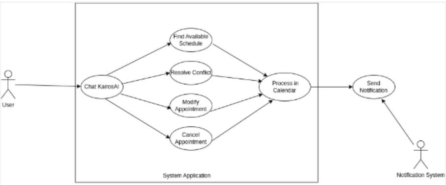
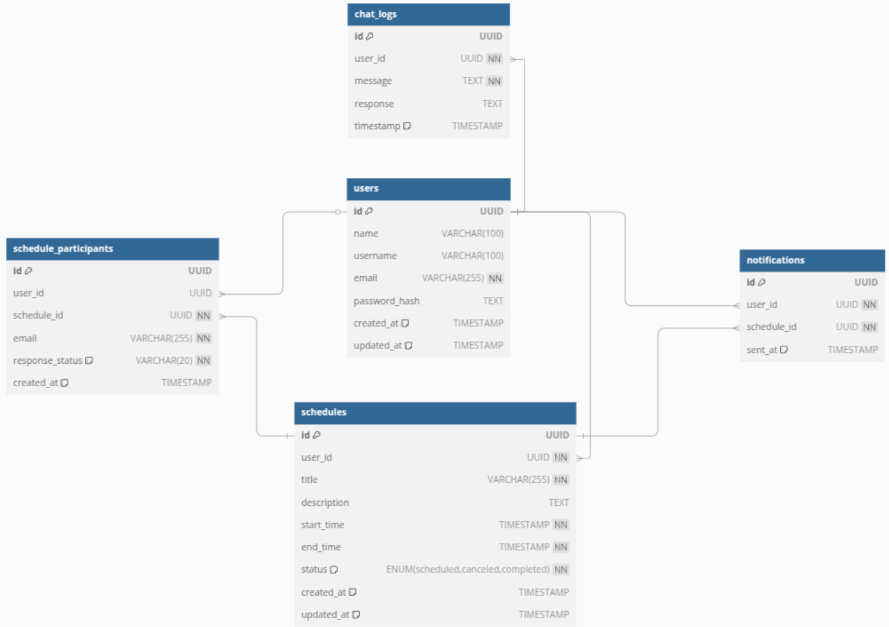
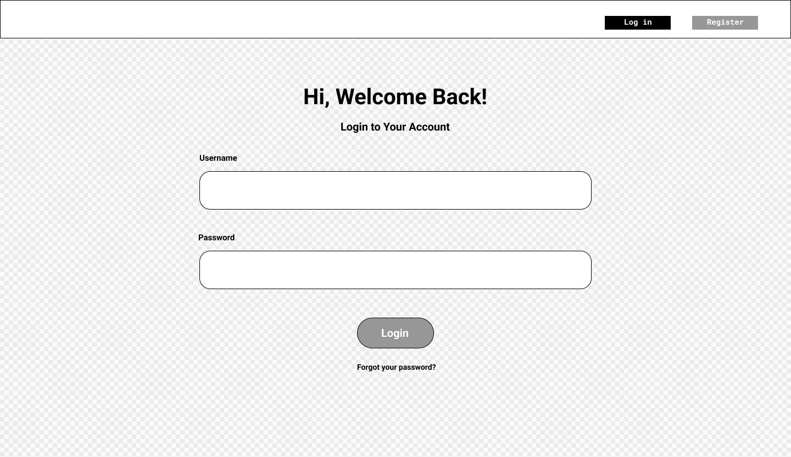
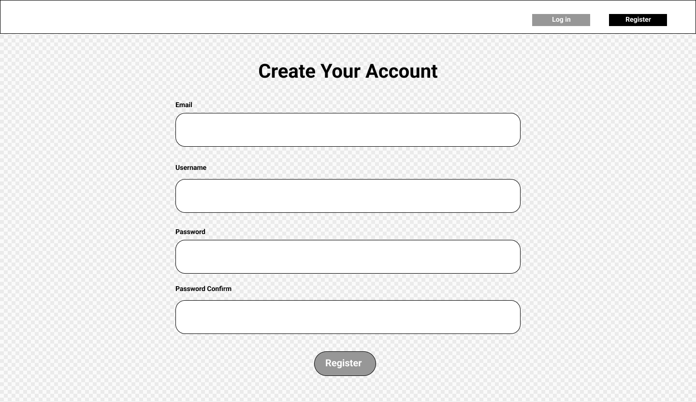
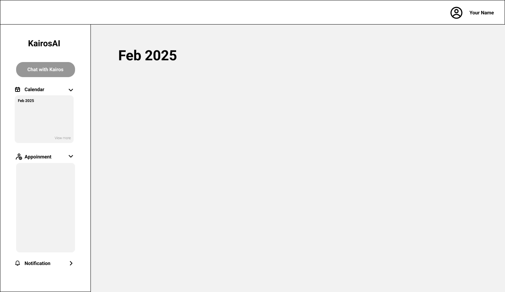
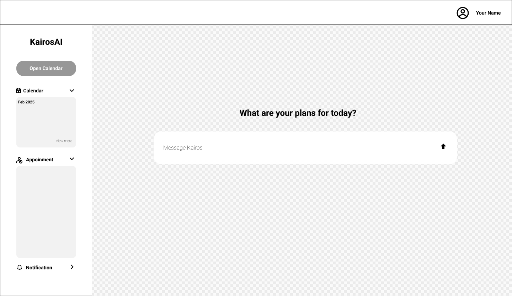
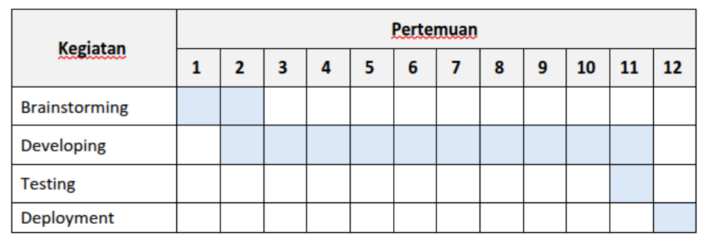

# Metodologi SDLC

## Metodologi yang digunakan

Agile

## Alasan pemilihan metodologi

Metodologi agile cocok digunakan pada project ini karena software yang kami buat terbagi menjadi beberapa fokus utama, yaitu **AI based scheduling, front end development, & backend development** yang mana memerlukan fleksibilitas, pengembangan secara berkelanjutan, dan penyampaian progress tiap minggunya. AI model yang dikembangkan memerlukan feedback dan pengembangan berkelanjutan karena training ai ini berdasarkan user feedback.

## Perancangan Tahap 1-3 SDLC

### Tujuan dari produk

Produk ini nantinya akan membantu user untuk membuat jadwal hanya dengan memerintahkan melalui chatting AI. Produk ini akan menyusun jadwal user secara efisien dan tidak berkonflik dengan jadwal lainnya. Memudahkan user untuk melihat jadwal yang telah dibuat hanya dengan chat ke AI.

### Pengguna potensial dari produk dan kebutuhan para pengguna tersebut

Pekerja kantoran, Mahasiswa, Orang yang memiliki intensitas kesibukan tinggi dengan jadwal yang padat

### Use case diagram

### Functional requirements

| FR                                | Deskripsi                                                                                                                                                                                                                                                                                                              |
| --------------------------------- | ---------------------------------------------------------------------------------------------------------------------------------------------------------------------------------------------------------------------------------------------------------------------------------------------------------------------- |
| FR1 - Register                    | Fitur Register memungkinkan pengguna baru untuk membuat akun dalam sistem KairosAI. Pengguna harus memasukkan informasi seperti nama, email, dan password untuk mendaftar. Sistem akan memverifikasi apakah email sudah terdaftar sebelumnya, serta mengenkripsi password sebelum menyimpannya di database.            |
| FR2 - Login                       | Fitur Login memungkinkan pengguna untuk masuk ke sistem menggunakan email dan password yang telah terdaftar. Sistem akan melakukan autentikasi untuk memastikan kredensial yang dimasukkan benar.                                                                                                                      |
| FR3 - Chat to Schedule            | Fitur Chat to Schedule memungkinkan pengguna untuk membuat jadwal dengan mengetikkan perintah berbasis teks dalam chat. KairosAI akan memproses teks menggunakan AI untuk mengekstrak informasi terkait jadwal (seperti judul, waktu mulai, waktu selesai, dan deskripsi) dan menyimpannya sebagai event dalam sistem. |
| FR4 - Schedule Management         | Fitur Schedule Management memungkinkan pengguna untuk mengelola jadwal mereka secara manual tanpa melalui ai chat.                                                                                                                                                                                                     |
| FR5 - Schedule Participants       | Fitur Schedule Participants memungkinkan pengguna untuk menambahkan peserta ke dalam jadwal. Peserta dapat berupa pengguna terdaftar dalam sistem atau tamu eksternal (dengan email).                                                                                                                                  |
| FR6 - Notification                | Fitur Notification memberikan pemberitahuan kepada pengguna mengenai pengingat schedule.                                                                                                                                                                                                                               |
| FR7 - Schedule Conflict Detection | Mendeteksi jika ada bentrokan waktu                                                                                                                                                                                                                                                                                    |

### Entity relationship diagram

### LoFi Wireframe

### Gantt-Chart

